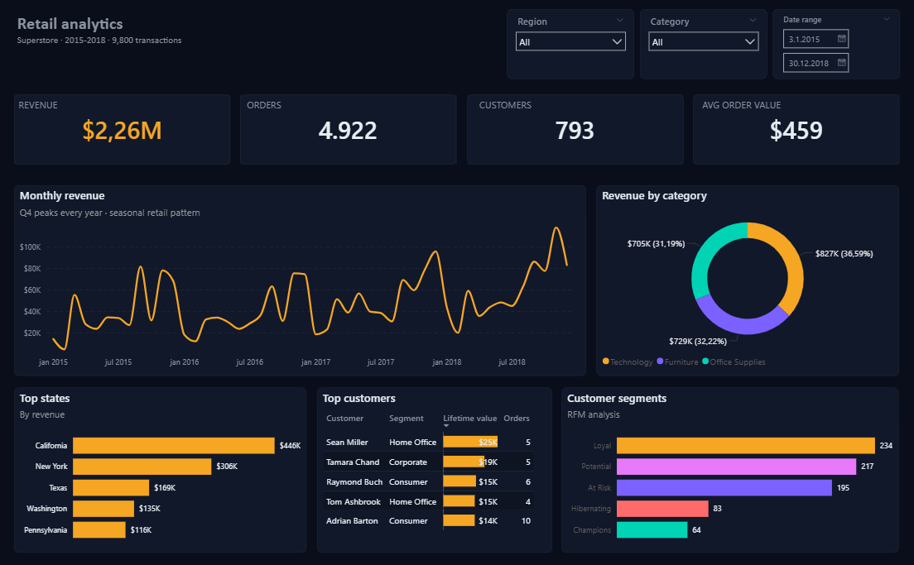

# Retail Analytics Dashboard

An end-to-end retail analytics project built from scratch — from raw CSV to a normalized MySQL database, SQL views with window functions, and an interactive Power BI dashboard with a custom dark theme.

---

## What this project does

Takes 9,800 retail transactions from the Superstore dataset (2015–2018) and turns them into a fully interactive dashboard that answers four business questions:

- How is revenue trending over time?
- Which customers, products, and regions drive the most value?
- How are customers segmented by behavior?
- Where are the growth opportunities?

---

## How it was built

### 1. Database design
Normalized the flat CSV into a 5-table MySQL schema — customers, products, orders, order_items, and regions. Each table holds one type of thing, connected through foreign keys. Roughly a star schema with order_items as the fact table.

### 2. ETL
Python script (pandas) reads the CSV, cleans it, splits it into 5 normalized tables, and loads it into MySQL. 793 customers, 1,861 products, 4,922 orders, 9,800 line items.

### 3. SQL views
8 views compute the KPIs the dashboard needs. Three techniques used throughout:

- **Joins** — 5-way join in the main view combining all tables
- **Aggregations** — SUM, COUNT, AVG grouped by month, region, category, customer
- **Window functions** — LAG for month-over-month growth, RANK for customer rankings, NTILE(5) for RFM segmentation, ROW_NUMBER for top-N product filtering, SUM() OVER for running totals

### 4. Power BI dashboard
Connected Power BI to MySQL, imported the 8 views, built a single-page dashboard with a custom dark theme. DAX measures drive the KPI cards so they recalculate live when filters are applied. Bidirectional relationships ensure all visuals respond to the same slicers simultaneously.

---

## Key insights

**Seasonality is consistent.** Q4 peaks every year without exception. January always drops. Plan inventory and marketing around this cycle.

**The West dominates, the South lags.** West drives 31% of revenue ($710K). South is the weakest region at $389K — the clearest growth opportunity.

**Categories are balanced.** Technology, Furniture, and Office Supplies are within 5 percentage points of each other — unusual for retail and suggests genuine product diversification.

**Revenue is concentrated.** Top 5 customers generate $88K — under 1% of customers driving ~4% of revenue. These accounts need VIP treatment.

**195 customers are At Risk.** They were good buyers once but have gone quiet. A win-back campaign targeting this segment has strong ROI potential since purchase intent has already been demonstrated.

---

## Tech stack

| Layer | Tool |
|---|---|
| Raw data | Superstore dataset (Kaggle) |
| ETL | Python (pandas) |
| Database | MySQL 8.0 |
| Analytics layer | SQL (8 views, window functions) |
| Visualization | Power BI Desktop |
| Live calculations | DAX measures |

---

## Files

| File | Description |
|---|---|
| `01_schema.sql` | MySQL schema — 5 tables, PKs, FKs, indexes |
| `02_etl.py` | Python ETL script |
| `02_data.sql` | Pre-generated INSERT statements |
| `03_views.sql` | All 8 KPI views |
| `retail_analytics_dashboard.pbix` | Power BI dashboard file |
| `dashboard.pdf` | PDF export of the dashboard |

---

## Data source

[Superstore Dataset — Kaggle](https://www.kaggle.com/datasets/vivek468/superstore-dataset-final)

Public retail sample dataset, widely used in the BI community.
